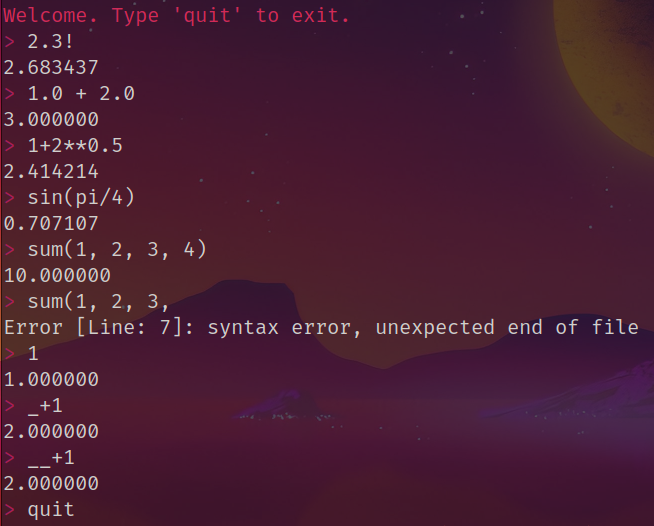

# QuickCalc
A terminal-based calculator program was made using [flex](https://github.com/westes/flex), [bison](https://www.gnu.org/software/bison/), and C++.



## Features
- **Basic Arithmetic Operations:** Addition, subtraction, multiplication, and division are supported.
- **Built-in Functions:** The calculator includes a variety of built-in functions such as trigonometric functions (sin, cos, tan), logarithmic functions (log, log10), exponential functions (exp), square root (sqrt), and [more](https://github.com/Saphereye/quick-calc/blob/f303041237272f3e912d50a133932d89e0586228/src/parser.y#L23).
- **Reusing the previous answer:** The calculator keeps track of the previous answer and allows users to reference it in subsequent calculations using `_`. If you want to access the previous answer, use `_` in the calculation. If you want to use the answer two calculations ago, just use `__` (2 times `_`)
- **Error Handling:** Comprehensive error handling for invalid input and mathematical errors.

## Installation
1. Requirements: >=C++17, flex, bison
2. **Clone the Repository**: Clone this repository to your local machine.

    ```bash
    git clone https://github.com/Saphereye/flex_bison_calc
    ```
3. **Build the project**

    ```bash
    cd flex_bison_calc
    make repl
    ```

## Features
- Basic arithmetic
    ```bash
    > 3 * 4
    12.000000
    > 255 ** 4
    4228250625.000000
    > 1/6
    0.166667
    ```
- Built-in functions
    ```bash
    > sum(1, 2, 3, 4, 5, 6)
    21.000000
    > sin(3.14)
    0.001593
    > median(4, 5, 3, 2, 1)
    3.000000
    > 10%3
    1.000000
    > 10.1%3.1
    0.800000
    ```
- Special functions and variables
    ```bash
    > 5!
    120.000000
    > 5.1!
    142.451944
    > 5!!
    6689502913449127120509299431182031258053015071153310066918800146811629520790841061032122839118801296905792978698449838385553111280551361744470298751804274423893297360062561614877543920066726903939072.000000
    > 4C2
    6.000000
    > 4P2
    12.000000
    > e
    2.718282
    > pi
    3.141593
    ```
- Referencing the previous answer
    ```bash
    > 1+1
    2.000000
    > _+1
    3.000000
    > __+1
    3.000000
    ```
- Descriptive error reporting
    ```bash
    > 1+
    Error [Line: 1 Column: 0]: syntax error, unexpected end of file
    > sin(1,,2)
    Error [Line: 2 Column: 7]: syntax error, unexpected ','
    > sin(cos(sin(1) +))
    Error [Line: 3 Column: 17]: syntax error, unexpected ')'
